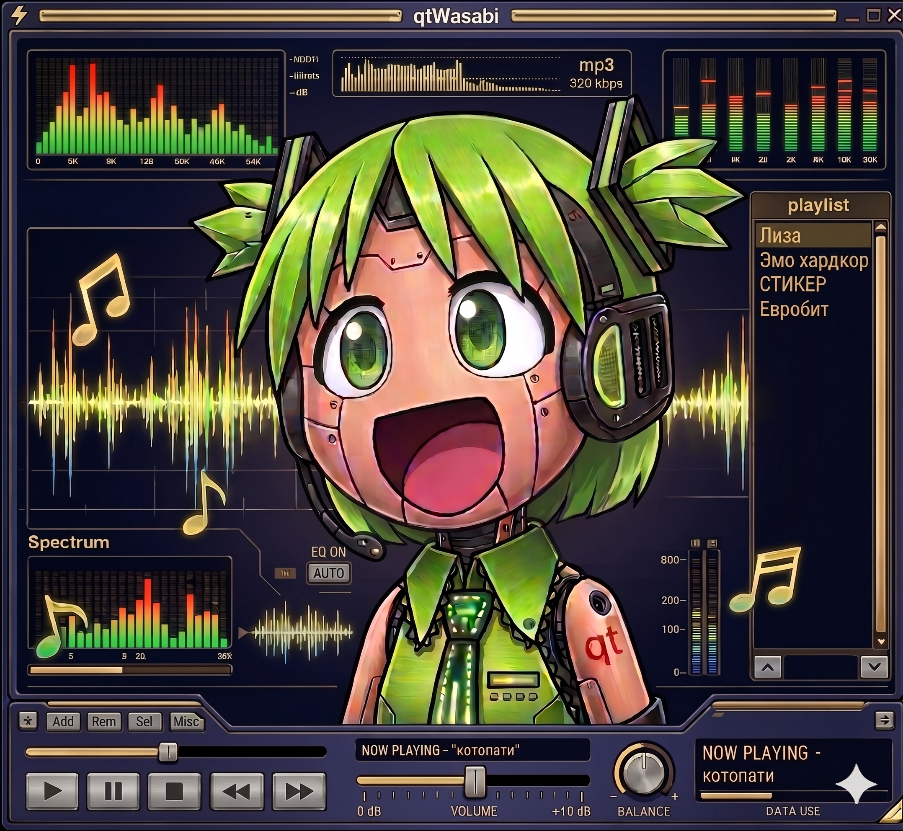

<p align="center">
  
</p>

<h3 align="center">qtWasabi</h3>

A Qt-native skin engine **inspired by** Winamp's Wasabi 1 and Wasabi 2,
built fresh for the latest Qt with the goal of running Modern Winamp
skins on **any themeable Winamp clone**, Audacious, WACUP, future
projects, across Linux, macOS, and Windows. Apple Silicon native.

<p align="center">Pronounced "cute Wasabi". The "qt" is Qt the framework, which spells itself "cute".</p>

### Approach: hybrid

Re-implementing the Maki bytecode VM from scratch is a multi-year
bug-hunt — thousands of shipped skins exercise small quirks of the
real VM, and the only spec is the running code. Porting the entire
open-sourced Wasabi C++ to Linux is also impractical: the 2024 Llama Group
release ships with `#error port me` markers across the BFC platform
layer (file I/O, keyboard, window, canvas) and an incomplete-and-
abandoned X11 port.

qtWasabi splits the difference:

| Component | Source | Why |
|---|---|---|
| **Maki bytecode VM** | official `/Src/Wasabi/api/script/`, **unmodified** | bit-perfect compatibility with every shipped Modern skin — no risk of re-implementation drift breaking obscure scripts |
| **Minimal BFC subset** | official `/Src/Wasabi/bfc/{memblock,critsec,foreach,ptrlist,nsguid,thread}` | POSIX-clean parts of Wasabi's foundation library that the VM depends on. The unported Linux platform pieces (`std_file`, `std_keyboard`, `std_wnd`, …) we do **not** use |
| **Wasabi widget classes** (`Group`, `Layer`, `Button`, `Slider`, `Text`, `Animation`, `Timer`, `Container`, …) | **qtWasabi's own Qt6 implementation** | matches Wasabi's documented behaviour and observed-from-source quirks (the libwasabiq prototype proved which quirks matter) but is fresh code rendering through `QPainter` |
| **Skin XML parser, sendparams, gammaset, font loading** | **qtWasabi's own** | Qt-native, no platform port needed |
| **Window/canvas/event integration** | **qtWasabi's `qt6/`** | `QWidget`/`QPainter`-native, replaces `Src/Wasabi/qt6/`'s 2015-era stub |

**What this gives us:**

- Maki scripts run on the *actual* shipped VM. Any quirk a skin
  depends on works automatically — we never have to chase down "why
  does titlebar.m centre wrong on this one skin".

- Widget rendering is Qt-native, so HiDPI works, Wayland works,
  Apple Silicon works, no platform-port quagmire.

- qtWasabi itself is freshly-authored Qt6 code, redistributable, and
  small enough to be embeddable in any Qt media player.

**What this costs:**

- Wasabi's *script bindings* — the C++ classes the VM calls into for
  `setVisible`, `getAutoWidth`, `setXmlParam`, etc. — have to bridge
  the original VM's `ScriptObject` interface to our Qt-native widgets.
  That's a thin shim per binding (~40 native classes, mostly
  one-liners forwarding to our `Widget` base).

- The Wasabi widget *behaviour* is matched against the open-source release
  as canonical spec. Where we got it visibly wrong in the libwasabiq
  prototype (text-widget +2 inset, getAutoWidth +N padding, etc.),
  we know exactly where to fix.

The pixel-counted reference renders + the Maki-opcode-coverage tests
from the libwasabiq prototype carry forward as regression harness.

### Repo layout

```
public/WasabiQt/      — embedder-facing C++ API (Host, Skin, Version)
src/                  — engine: skin loader, host adapter, widget
                        tree, sendparams, gammaset, fontloader
qt6/                  — modern Qt6 rendering and event adapter
                        (QtCanvasAdapter, QtWindowAdapter, …)
script-bridge/        — ScriptObject shims wrapping our widgets to
                        the Wasabi VM's binding interface (compiles
                        against WASABI_SRC_DIR/api/script/scriptobj.h)
cmake/                — FindWasabiSrc + package config
tests/                — pixel-regression + Maki-opcode-coverage
                        harness against canonical reference renders
scripts/              — fetch-wasabi.sh (downloads open-source release
                        from archive.org into ./wasabi-src/)
packaging/            — RPM spec, macOS .dmg builder, installer.sh
```

### Build / install

```bash
# Quickest path on Fedora / RHEL / Debian / Arch / openSUSE / macOS:
curl -fsSL https://qtwasabi.org | sh

# Or step-by-step:
git clone https://github.com/kleberbaum/qtWasabi
cd qtWasabi
./scripts/fetch-wasabi.sh           # downloads open-source release
./build.sh                           # configure + build + install
```

Full per-distro instructions, packaging recipes (RPM + macOS .dmg),
embedder integration (shared lib + static archive + CMake config +
pkg-config), and troubleshooting in [`BUILD.md`](BUILD.md).

### What's vendored vs supplied vs ours

| Path inside repo | Origin | Licence |
|---|---|---|
| `public/`, `src/`, `qt6/`, `cmake/`, `tests/`, `scripts/`, `packaging/`, `build.sh`, `BUILD.md`, `README.md` | **qtWasabi (this repo)** | MIT |
| `wasabi-src/Src/...` (created by `scripts/fetch-wasabi.sh`, `.gitignore`d) | **user-supplied at build time** from the public archive.org mirror | Winamp Collaborative License v1.0 (the user obtains it under §3 "propagate Covered works that you do not Convey") |

qtWasabi contains **no Winamp-licensed source code in the repo or
git history**. The build expects the user to supply their own
`WASABI_SRC_DIR` pointing at an extracted open-source release tree, the
same way console emulators expect a user-supplied BIOS.

### What is BFC?

BFC = **B**eex **F**oundation **C**lasses, Nullsoft's homegrown C++
foundation library. Written ~2000–2002 because the C++ STL wasn't
reliably portable across the compilers Wasabi had to target (MSVC 6,
GCC 2.x, CodeWarrior, Borland). It is literally Wasabi's stdlib —
every Wasabi class transitively pulls BFC.

```
┌──────────────────────────────────────────────────────────────────┐
│  Maki VM + script bindings + Wasabi widget classes               │
│  (vcpu.cpp, scriptmgr, container, button, slider, ...)           │
│                          USES                                    │
│  ┌────────────────────────────────────────────────────────────┐  │
│  │  BFC                    (Wasabi's stdlib + framework)      │  │
│  │  ┌──────────────┬───────────────┬─────────────────────┐    │  │
│  │  │ containers   │ GUID +        │ object lifetime     │    │  │
│  │  │ ptrlist tlist│ dispatch      │ node depend         │    │  │
│  │  │ stack memblk │ nsguid        │ (parent-child trees)│    │  │
│  │  │ freelist     │ dispatch.h    │ depview             │    │  │
│  │  ├──────────────┼───────────────┼─────────────────────┤    │  │
│  │  │ threading    │ strings       │ MISC                │    │  │
│  │  │ thread       │ wasabi_std    │ assert error        │    │  │
│  │  │ critsec      │ string/       │ foreach pair        │    │  │
│  │  │ reentry      │               │ math rect           │    │  │
│  │  ├──────────────┴───────────────┴─────────────────────┤    │  │
│  │  │ platform/      types.h, win32.h, linux.h, osx.h    │    │  │
│  │  ├──────────────┬───────────────┬─────────────────────┤    │  │
│  │  │ std_file ✗   │ std_keyboard ✗│ std_wnd ✗ loadlib ✗ │ ←  │  │
│  │  │ (port me)    │ (port me)     │ (port me / X11 stub)│    │  │
│  │  └──────────────┴───────────────┴─────────────────────┘    │  │
│  └────────────────────────────────────────────────────────────┘  │
└──────────────────────────────────────────────────────────────────┘
                              │
                              ▼ (BFC sits on)
                   stdint, pthread, dlfcn, libc
```

**Two distinct layers** matter to us:

1. **Foundation** (top-half: containers, GUIDs, dispatch, node-tree,
   threading, strings, math) — POSIX-clean ~3000 LOC. This is what
   the Maki VM and script-binding registry depend on. Compiles on
   Linux/macOS without modification.

2. **Platform** (bottom-half, marked ✗: `std_file`, `std_keyboard`,
   `std_wnd`, `loadlib`) — the unfinished part. Win32 done, macOS
   partly, Linux X11 abandoned circa 2008. qtWasabi does **not**
   use these — file I/O goes through Qt's `QFile`, keyboard through
   `QKeyEvent`, window through `QtWindowAdapter`, plugins through
   `QLibrary`. The compile shim header tells BFC's transitively-
   included `std_file.h` etc. that yes, the symbols are declared
   somewhere — but the VM never actually calls them, so the linker
   never has to find an implementation.

#### How Wasabi uses BFC's GUID + dispatch

This is the part that surprises people coming from modern C++. Every
Wasabi class derives from `Dispatchable` and overrides:

```cpp
virtual void *dependent_getInterface(const GUID *classid) {
    HANDLEGETINTERFACE(MyClass);          // matches my own class GUID
    HANDLEGETINTERFACE(MyParentClass);    // matches my parent class
    return SUPER::dependent_getInterface(classid);
}
```

When Maki script does `obj.setVisible(0)`, the VM looks up
`obj`'s `setVisible` method by **GUID-keyed dispatch table**: it
asks the C++ object "are you a `GuiObject` (GUID
`4ee3e199-c636-4bec-...`)?" via `dependent_getInterface`, then calls
the registered method on that interface. This is how Wasabi did
COM-ish polymorphism without actually being COM. Every script
binding uses it.

Our `script-bridge/` shims are exactly this: a thin
`Dispatchable`-derived adapter per Qt-native widget that answers
`dependent_getInterface(guid_GuiObject)` with itself, so the VM
can call its bindings against our widget. ~10 LOC per binding.

### What we pull from the official Winamp release

Only this irreducible subset compiles into the qtWasabi library:

- `bfc/memblock.cpp`, `critsec.cpp`, `foreach.cpp`, `freelist.cpp`,
  `nsguid.cpp`, `ptrlist.cpp`, `stack.cpp`, `node.cpp`, `thread.cpp`
  → ~3000 LOC, pure-C++, POSIX-clean
- `bfc/wasabi_std.cpp`, `wasabi_std_rect.cpp` → math/string utilities
- `api/script/vcpu.cpp`, `scriptmgr.cpp`, `objecttable.cpp`,
  `scriptobj.cpp`, `script.cpp`, `guru.cpp` → ~5000 LOC Maki VM
  + script registry

Total: about 8000 LOC pulled from the official Winamp release at
build time, all platform-independent.

Everything else — the BFC platform layer (`std_file`, `std_keyboard`,
`std_wnd`, `linux.cpp`, the X11 backend), the widget classes, the
canvas/window infrastructure, the sendparams handling, the XML parser
— is **qtWasabi's own implementation**, written ground-up against
modern Qt6 idioms.

### Why this matters to me

The dream is selfish. I want to listen to music on my Apple M-Series
Mac the way I did on Windows in the early 2000s — Winamp running
natively on **Asahi Linux** and **macOS**, painting through the same
Qt that already gives me a beautiful desktop on Asahi. No Wine, no
x86 emulation, no nostalgia-VM in a window. Just the actual skin
engine, on aarch64 silicon, looking exactly the way it does in the
canonical WACUP / Winamp Modern reference renders.

The bigger goal is that this becomes embeddable in any themeable
Winamp clone. Wasabi was a great UI framework that nobody else
could use because it shipped welded to one player's runtime.
qtWasabi is the small, embeddable piece you actually wanted —
implement a `WasabiQt::Host` (~40 virtual methods), drop a
`WasabiQt::Skin` into your `QMainWindow`, and your media player has
classic `.wal` skin support.

### Inspirations

- **Wasabi 1** — `Src/Wasabi/api/`'s widget framework and Maki VM.
  The VM is vendored unmodified; the widget classes are
  re-implemented in Qt for the platform-port reasons described
  above. Their documented behaviour is the spec.
- **Wasabi 2** — `Src/replicant/`'s service-oriented rewrite, never
  finished. qtWasabi shares its goal (cross-platform, modular) and
  goes further by replacing the rendering layer entirely with Qt.
- **`Src/Wasabi/qt6/QtWindowAdapter` / `QtCanvasAdapter`** — the
  abandoned ~2015 Qt6 adapter shim. Useful as **reference** for what
  surface to expose to Wasabi expectations, but the implementation
  there targets a 2015-era Qt with several MOC workarounds no longer
  needed. qtWasabi targets the **latest Qt** (Qt6 today, Qt7+ when
  it ships).
- **`libwasabiq` prototype** (deleted; lives in
  [`winamp-linux`](https://github.com/kleberbaum/winamp-linux) git
  history) — earlier clean-room re-implementation that taught us
  where every visible gap lives in the open-source release. Test harness,
  reference image corpus, and host-interface design carry forward.

### Targets

- **Linux** — Asahi (aarch64), Fedora, Arch, Debian, openSUSE.
  Wayland-first.
- **macOS** — Apple Silicon native (M-series), Intel as a courtesy.
- **Windows** — because of course.

Qt6 abstracts the rest. No platform-specific render code beyond
what Qt itself does.

### Status

Bootstrapping. Concrete next milestones, in dependency order:

1. **`bfc/` minimal subset compiles** — `memblock`, `critsec`,
   `foreach`, `freelist`, `nsguid`, `ptrlist`, `stack`, `node`,
   `thread`, `wasabi_std` against gcc/clang on Linux/macOS, with a
   shim header that pre-defines the file-I/O symbols BFC's
   transitively-included `std_file.h` looks for. ~half a day's work
   once the shim is right.

2. **Maki VM compiles + runs a `.maki` blob** — `vcpu`, `scriptmgr`,
   `objecttable`, `scriptobj` linked against (1). Smoke test:
   load a compiled `std.mi`-using script, dispatch `onScriptLoaded`
   against a stub `SystemObject`, no opcodes left unhandled.

3. **qtWasabi widget tree + skin XML parser** — port the
   well-tested libwasabiq XML parser + Widget tree into qtWasabi's
   `src/`. Parses WinampModernPP's `skin.xml`, dumps the
   `Container`/`Layout`/`groupdef` tree.

4. **First widget paints through Qt** — implement `Layer::paint`,
   `Group::paint`, etc. in qtWasabi's widget classes routing to
   `QtCanvasAdapter`. Player frame chrome (top corners + horizontal
   frame) renders inside a `QtWindowAdapter`.

5. **Script bindings bridge** — `script-bridge/` shims our
   Qt-native widgets to the VM's `ScriptObject` interface so Maki
   scripts can call `setVisible`, `setXmlParam`, `getAutoWidth`,
   etc. against them. The pixel-counted libwasabiq fixes (text +2
   inset, `getAutoWidth + 11`, per-instance enclosing-group lookup,
   onSetXuiParam args order, …) carry forward as canonical
   bridging behaviour.

6. **WACUP titlebar pixel-regression test passes** — `tests/`
   compares our render against the canonical 354×164 reference.
   When this passes, winamp-linux's
   `WasabiQt::Skin::load("/path/to/WinampModernPP")` shows the
   correct thing in the player.

Each milestone is mechanical work (add sources to CMake, fix the
next compile error, run the next test) — but they're genuinely a
few sessions' work, not a single evening.

The reference embedder is
[**winamp-linux**](https://github.com/kleberbaum/winamp-linux) —
already wired up to link against the qtWasabi library; will swap
in `WasabiQt::Skin::load` for its current modern-skin code path
once milestone 6 lands.

### License

qtWasabi (everything in this repo): **MIT**, see [`LICENSE`](LICENSE).

The Wasabi source you supply at build time: Winamp
Collaborative License v1.0, see the source archive's own
`LICENSE.md`. Your responsibility to honour. WCL §3 grants
"propagate Covered works that you do not Convey", that's the
clause that lets you build qtWasabi against your local copy.

### Mascot

Wasabi is the project's good-luck charm and a friendly face cheering
the work along. She is a spirit animal for qtWasabi, nothing more.
Not a logo, not a trademark.
